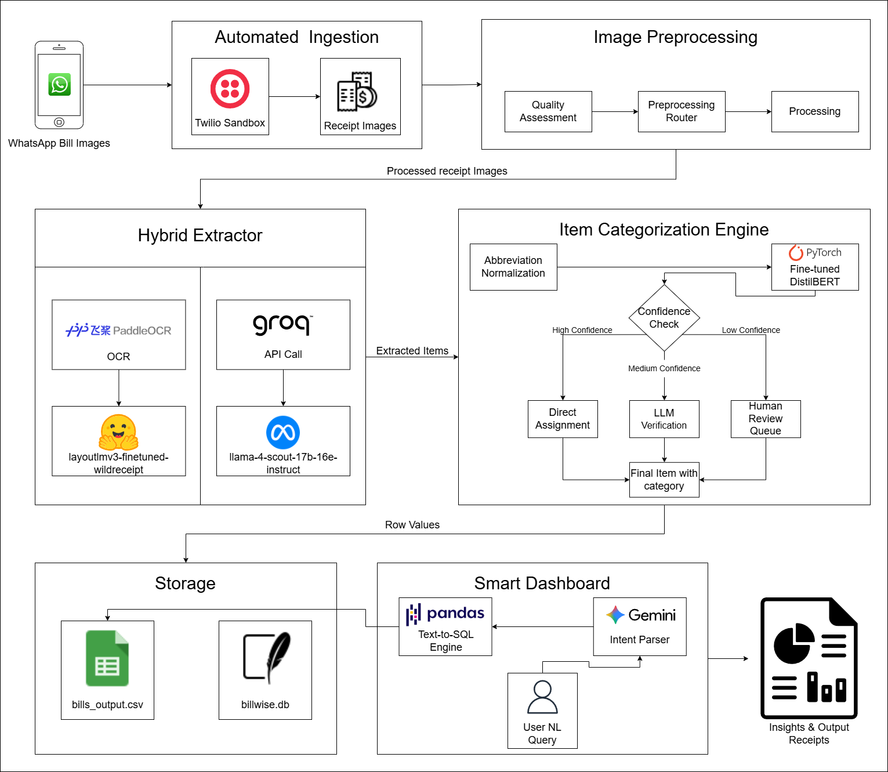

# BillWise

> **Automated restaurant expense management through hybrid document understanding.**

BillWise is a production-oriented pipeline that helps restaurant operators track raw goods and ingredient purchases from wholesalers and retailers — eliminating manual bookkeeping through AI-driven bill ingestion, extraction, categorization, and analytics.

---

## Architecture

<!-- INSERT ARCHITECTURE DIAGRAM HERE -->
<!-- Recommended: export your diagram as architecture_diagram.png and place it in docs/images/ -->
<!-- Then replace this comment block with: -->
<!--  -->

---

## Table of Contents

- [Overview](#overview)
- [Core Capabilities](#core-capabilities)
- [End-to-End Flow](#end-to-end-flow)
- [Hybrid Extraction Strategy](#hybrid-extraction-strategy)
- [Duplicate Detection](#duplicate-detection)
- [Item Categorization](#item-categorization)
- [Storage Modes](#storage-modes)
- [Supported Interfaces](#supported-interfaces)
- [Tech Stack](#tech-stack)
- [Project Structure](#project-structure)
- [Setup](#setup)
- [Environment Variables](#environment-variables)
- [Running the System](#running-the-system)
- [Local Development Workflow](#local-development-workflow)
- [Analytics and Chat Behavior](#analytics-and-chat-behavior)

---

## Overview

Restaurant operators collect bills across multiple sources, formats, and image qualities. Manual bookkeeping is slow, error-prone, and hard to analyze at scale. BillWise addresses this with a fully automated pipeline combining:

- **OCR + LayoutLM** for structured layout-aware field extraction
- **VLM-based semantic fallback** for merchant names and noisy receipts
- **DistilBERT-based item categorization** with LLM verification and human-review escalation
- **Two-layer duplicate detection** across exact image hashes and semantic bill fingerprints
- **Local CSV and Google Cloud Storage** backends switchable via environment variable
- **Flask API and Streamlit dashboard** for natural-language and visual analytics

The project has a clean production runtime under `main_workflow/`, with older experimental pipelines preserved under `experiments/` for reproducibility.

---

## Core Capabilities

| Area | Capabilities |
|---|---|
| **Ingestion** | Twilio webhook (production), local simulation (development) |
| **Duplicate Detection** | Exact image hash + semantic fuzzy matching on store/date/total |
| **Extraction** | PaddleOCR, LayoutLM, VLM fallback, hybrid field merger |
| **Categorization** | DistilBERT classifier, LLM mid-confidence verification, human-review escalation |
| **Storage** | Google Cloud Storage (production), local CSV (development) |
| **Analytics** | Streamlit dashboard, Flask `/chat` UI, `/api/query` NLP endpoint |

---

## End-to-End Flow

```
Bill arrives
    │
    ▼
Duplicate Detection
    ├── Layer 1: Exact image hash check
    └── Layer 2: Semantic duplicate (store + date + total with fuzzy store matching)
    │
    ▼
Hybrid Extraction
    ├── OCR / LayoutLM path  →  structured numeric fields
    ├── VLM path             →  merchant name + semantic fallback
    └── Hybrid merger        →  field-level sources, review flags, arithmetic checks
    │
    ▼
Item Post-Processing
    ├── Normalize abbreviations and noisy item strings
    ├── Categorize items into supported categories
    └── Escalate uncertain items → HUMAN_REVIEW_NEEDED
    │
    ▼
Storage
    ├── GCS bucket  (BILLWISE_STORAGE_MODE=gcs)
    └── Local CSV   (BILLWISE_STORAGE_MODE=local)
    │
    ▼
Analytics
    ├── Streamlit dashboard (visual exploration)
    └── Flask chat / API    (natural language querying)
```

---

## Hybrid Extraction Strategy

BillWise uses a two-path extraction pipeline because no single approach is reliably accurate across all receipt formats.

### OCR / LayoutLM Path

Best for layout-sensitive numeric fields:

- Time, subtotal, tax, total, receipt number
- Layout-aware token mapping over spatially structured documents

### VLM Path

Best for semantic and merchant fields:

- Merchant / store name
- Semantic item interpretation
- Fallback when OCR/LayoutLM output is weak or inconsistent

### Hybrid Merger

The merger combines both paths and records:

- Field-level source attribution (which path produced each field)
- Review flags for low-confidence fields
- Arithmetic inconsistency flags (e.g., subtotal + tax ≠ total)
- Item-level disagreements between paths

---

## Duplicate Detection

Duplicate detection runs before extraction to prevent re-processing.

**Layer 1 — Exact image hash**
Checks whether the same image bytes have already been processed.

**Layer 2 — Semantic duplicate**
Checks whether a bill with the same store, date, and total already exists, using fuzzy store name matching to handle minor OCR variation across scans of the same receipt.

---

## Item Categorization

Extracted items go through a multi-stage categorization pipeline:

1. **Abbreviation normalization** — noisy, abbreviated item strings are cleaned against an inventory-aware reference.
2. **DistilBERT classifier** — assigns items to supported categories.
3. **LLM verification path** — medium-confidence items are passed to an LLM for secondary classification.
4. **Human-review escalation** — low-confidence or unresolvable items are flagged as `HUMAN_REVIEW_NEEDED`.

---

## Storage Modes

BillWise supports two storage backends, controlled by the `BILLWISE_STORAGE_MODE` environment variable.

| Mode | Description | Storage Location |
|---|---|---|
| `local` | Development and testing | `main_workflow/data/dev/bills_output.csv` |
| `gcs` | Production-style cloud deployment | GCS bucket defined by `GCS_BUCKET_NAME` |
| `auto` | Automatically selects based on available credentials | GCS if credentials present, else local |

---

## Supported Interfaces

### 1. Flask App — Main Runtime (`main_workflow/app.py`)

The primary entrypoint for bill ingestion and chat-based analytics.

| Route | Description |
|---|---|
| `/` | Health check |
| `/webhook` | Twilio bill ingestion entrypoint |
| `/chat` | Browser-based chat UI |
| `/api/query` | Natural language analytics API |
| `/api/reset` | Reset session |
| `/api/reload` | Reload session data |

### 2. Streamlit Dashboard

The main visual analytics UI. Supports:

- **KPI overview** — spending summaries and trends
- **Vendor exploration** — per-vendor breakdowns
- **Receipt explorer** — individual bill inspection
- **Ask BillWise** — natural language analytics page
- **Human validation views** — review flagged items

### 3. Local Simulation Helper

For development without Twilio, simulate the full ingestion pipeline using a local receipt image:

```bash
python -m main_workflow.dev_tools.simulate_ingestion <image_path>
```

This follows the same logic as the production webhook flow: duplicate checks → extraction → categorization → storage → session reload.

To force-save even if a duplicate is detected:

```bash
python -m main_workflow.dev_tools.simulate_ingestion <image_path> --force-save
```

---

## Tech Stack

| Layer | Technologies |
|---|---|
| **Web framework** | Flask, Streamlit |
| **OCR** | PaddleOCR |
| **Structured extraction** | LayoutLM (HuggingFace Transformers), PyTorch |
| **VLM fallback** | Meta VLM via Google GenAI SDK |
| **Categorization** | DistilBERT (fine-tuned), PyTorch |
| **LLM analytics** | Gemini (Google GenAI SDK), Groq |
| **Analytics / query** | DuckDB, Pandas, Plotly |
| **Storage** | Google Cloud Storage, local CSV |
| **Ingestion** | Twilio (WhatsApp webhook) |
| **Runtime** | Python 3.11 |

---

## Project Structure

```text
BillWise/
├── main_workflow/                   # Production-oriented runtime
│   ├── app.py                       # Flask app (webhook, chat API, health)
│   ├── __init__.py                  # Auto-loads root .env
│   │
│   ├── extraction/                  # Hybrid extraction pipeline
│   ├── categorization/              # Normalization + classification runtime
│   ├── storage/                     # GCS / local CSV read-write layer
│   ├── chatbot/                     # Chat and API analytics runtime
│   ├── streamlit_dashboard/         # Analytical dashboard UI
│   ├── dev_tools/                   # Local ingestion simulation tools
│   ├── data/
│   │   └── dev/                     # Local development CSV storage
│   └── logs/
│
├── experiments/                     # Archived reference pipelines
│   ├── extraction_hybrid_reference/
│   ├── categorization_reference/
│   └── app_shell_reference/
│
├── checkpoints/                     # Trained model weights
│   └── full_ft_distilbert_unweighted_best.pt
│
├── data/                            # Datasets and categorized inventory data
│   └── Processed_Datasets/
│       └── Labeled/
│           └── merged_labeled.csv
│
├── .env                             # Local environment config (not committed)
├── .env.example                     # Environment variable template
├── .gitignore
├── README.md
└── requirements.txt
```

---

## Setup

### 1. Create a virtual environment

```powershell
# Windows PowerShell
py -3.11 -m venv .venv
.\.venv\Scripts\Activate.ps1
python -m pip install --upgrade pip setuptools wheel
```

```bash
# macOS / Linux
python3.11 -m venv .venv
source .venv/bin/activate
pip install --upgrade pip setuptools wheel
```

### 2. Install PyTorch separately

PyTorch is installed separately to preserve CUDA-enabled wheels.

```bash
# Example: CUDA 13.0
pip install torch torchvision --index-url https://download.pytorch.org/whl/cu130

# CPU only
pip install torch torchvision
```

### 3. Install project dependencies

```bash
pip install -r requirements.txt
```

### 4. Verify required assets

Ensure these files exist before running the system:

```
checkpoints/full_ft_distilbert_unweighted_best.pt
data/Processed_Datasets/Labeled/merged_labeled.csv
```

---

## Environment Variables

Copy `.env.example` to `.env` and fill in the required values:

```bash
cp .env.example .env
```

```dotenv
# Server
PORT=8080

# Twilio (required for production ingestion)
TWILIO_ACCOUNT_SID=
TWILIO_AUTH_TOKEN=

# Storage
BILLWISE_STORAGE_MODE=local          # local | gcs | auto
GCS_BUCKET_NAME=
GCS_BILLS_BLOB=bills_output.csv
LOCAL_BILLS_CSV=.\main_workflow\data\dev\bills_output.csv

# LLM APIs
GEMINI_API_KEY=
GROQ_API_KEY=

# UI ports
GRADIO_SERVER_NAME=127.0.0.1
GRADIO_SERVER_PORT=7860
STREAMLIT_SERVER_PORT=8501

# Model assets
CATEGORIZER_MODEL_PATH=.\checkpoints\full_ft_distilbert_unweighted_best.pt
CATEGORIZER_DATASET_PATH=.\data\Processed_Datasets\Labeled\merged_labeled.csv
```

> `main_workflow/__init__.py` automatically loads `.env` on startup.

---

## Running the System

### Flask main workflow

```bash
python -m main_workflow.app
```

Available at: `http://127.0.0.1:8080`

### Streamlit dashboard

```bash
streamlit run .\main_workflow\streamlit_dashboard\app.py --server.port 8501
```

Available at: `http://127.0.0.1:8501`

### Local ingestion simulation

```bash
python -m main_workflow.dev_tools.simulate_ingestion "C:\path\to\receipt.jpg"
```

---

## Local Development Workflow

A typical local development session:

```bash
# 1. Start Flask backend
python -m main_workflow.app

# 2. Start Streamlit dashboard (separate terminal)
streamlit run .\main_workflow\streamlit_dashboard\app.py --server.port 8501

# 3. Simulate bill ingestion
python -m main_workflow.dev_tools.simulate_ingestion "C:\path\to\receipt.jpg"

# 4. Open dashboard
# http://127.0.0.1:8501
```

---

## Analytics and Chat Behavior

### Without `GEMINI_API_KEY`

BillWise supports built-in local analytics for common queries:

- *How much did I spend?*
- *How many bills do I have?*
- *Which stores are in my data?*
- *What is my average bill?*
- *What is my latest bill?*

### With `GEMINI_API_KEY`

Full natural-language analytics are enabled through:

- **Flask** → `/api/query` endpoint
- **Streamlit** → *Ask BillWise* dashboard page

Richer queries such as spend breakdowns by category, vendor trends, and anomaly detection are supported with Gemini enabled.

---

## License

<!-- Add license information here -->